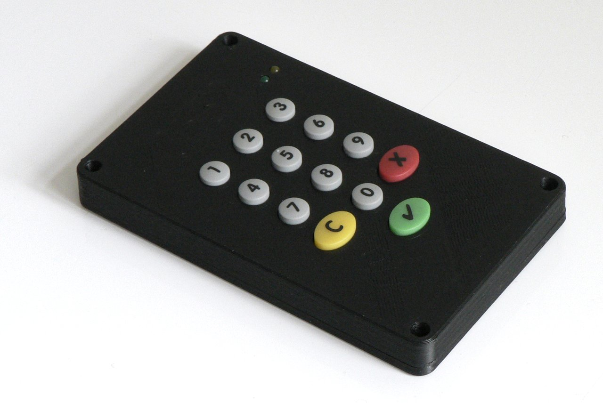

Introduction
============

The 0.332 is a mod of the SCM SPR332 v2 card reader:

  * compact 3D printed case

  * less weight

  * built-in OpenPGP smart card

  * USB-C interface

How to make it
==============

Materials:

* SCM SPR332 v2 smart card reader (big and heavy)

* double sided tape, e.g. TESA 4965

* thin enameled wire, e.g. ⌀ 2mm = AWG 12

* Mini SIM socket, e.g. the 1981959 by TE Connectivity AMP Connectors
  (Tyco Electronics)

* SparkFun BOB-15100 USB-C breakout board

* 56k resistor

* smart card in mini SIM format

* 4 × Screws: DIN 912, M2×6 mm

* 4 × Nuts: DIN 934, M2

Tools:

* soldering equipment

* 3D printing equipment

* 400 grid paper for wet sanding

Steps:

1. Break open the SPR332 v2, and take out:

   + PCB

   + rubber keypad

   + (weight, which makes a nice keyring pendant)

2. Desolder and remove components from the PCB:

   + buzzer (big black cylinder)

   + SIM card socket

   + USB cable

3. Tape down the mini SIM holder in the correct position.

4. Solder six wires to the mini SIM holder:

   + Make sure that the wires don’t block the slot.

   + Don’t apply too much solder, or else the pins contacting the SIM
     may loose their elasticity.

5. Short the two pins for detecting if a card has been inserted.

6. 3D print the two shells comprising the enclosure.

7. Make everything fit: If needed, trim spacers in the 3D printed
   enclosure; Wet sand the top layer of the prints.

8. Position the SPR332 v2 PCB and the SparkFun USB-C breakout board
   into the enclosure’s top shell.

9. Connect the USB-C breakout board, pulling up CC1 with the resistor
   connected to VBUS.

10. Insert the mini SIM card.

11. Assemble the enclosure and tighten the screws.

License
=======

Except where noted otherwise, files are licensed under the WTFPL.

Copyright © 2019 [Felix E. Klee](felix.klee@inka.de)

This work is free. You can redistribute it and/or modify it under the terms of
the Do What The Fuck You Want To Public License, Version 2, as published by Sam
Hocevar. See the COPYING file for more details.
